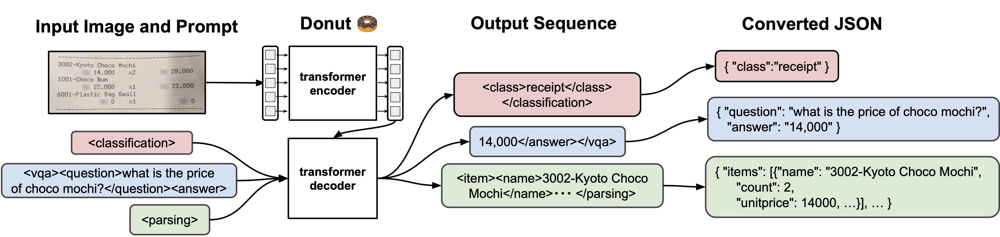
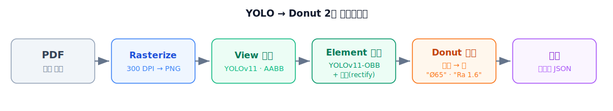
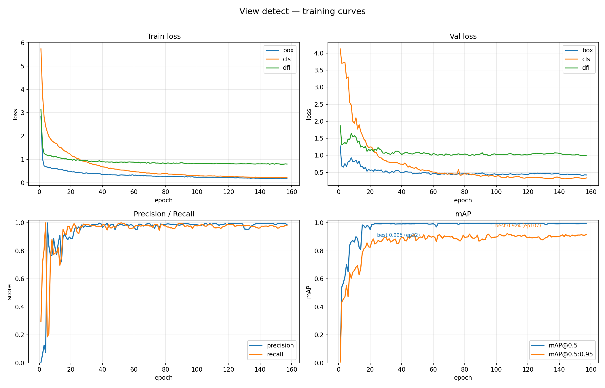
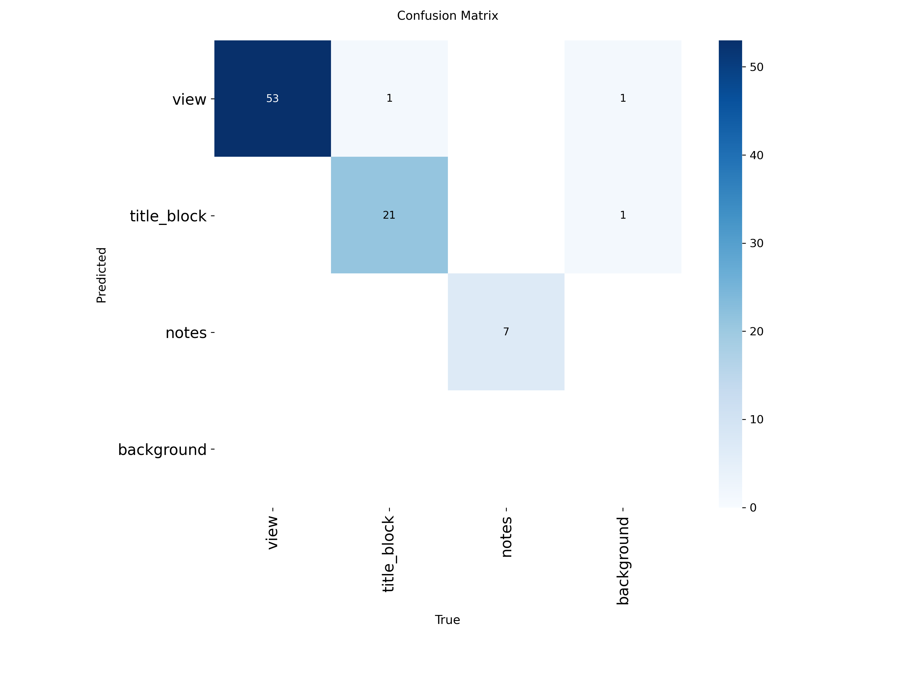
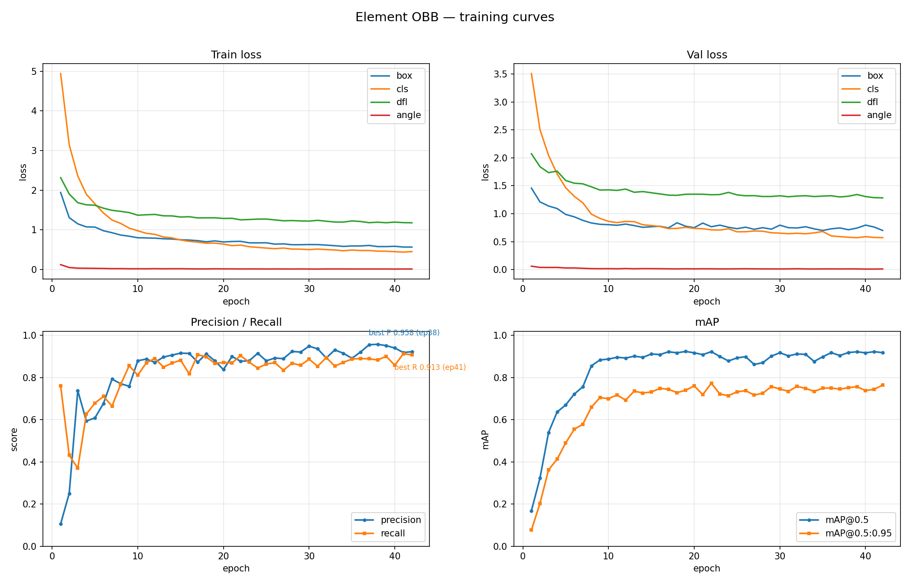

# Donut-VLM — 기계도면 정보 추출

한국 기계도면(표제란 · 치수 · 공차 · GD&T · 표면거칠기 · 볼트홀)을 **구조화 JSON** 으로 추출하는
[Donut](https://github.com/clovaai/donut)(Document Understanding Transformer) 파인튜닝 프로젝트입니다.
산출물은 **Jupyter 노트북 모음**이며, 각 노트북은 위 → 아래 순서로 실행하도록 작성돼 있습니다.
각 코드 셀 위에는 **`🔹 역할` 한 줄 요약 마크다운**이 있어, 셀을 펼치지 않아도 전체 흐름을 파악할 수 있습니다.



> **Donut**(Document Understanding Transformer): OCR 엔진 없이 이미지를 바로 읽는 비전 인코더(Swin) +
> 텍스트 디코더(BART) 구조의 멀티모달 seq2seq. 이미지 → 구조화 토큰열(→ JSON)을 end-to-end 로 생성합니다.

## YOLO → Donut 파이프라인

요소를 먼저 **검출·정렬해 작은 크롭**으로 만든 뒤, 그 크롭을 Donut 으로 읽습니다.
도면 전체를 작은 해상도(whole-page 베이스라인 기준 `1280×960`)로 줄이면 치수 글자가 뭉개지지만,
요소를 크롭해 작은 이미지(element Donut 은 `448×448`)로 인식하면 가독성이 높아 정확도가 좋아집니다.
(단, 현재 크롭 소스 자체가 저해상·블러라 인식 천장이 존재 — [`이미지품질_분석`](yolo_finetune_donut_pipeline/Element_Donut_이미지품질_분석.md).)
진입점은 [`yolo_finetune_donut_pipeline/`](yolo_finetune_donut_pipeline/) 입니다.



<details>
<summary>텍스트 다이어그램 (출력 JSON 형태 포함)</summary>

```
PDF ──rasterize(300 DPI)──▶ page.png
   ──view 검출 (YOLOv11, AABB)──▶ view 크롭
   ──element 검출 (YOLOv11-OBB)──▶ 정렬(rectify)된 element 크롭 (+ 타입)
   ──element Donut 인식──▶ 값 ("Ø65", "Ra 1.6" …)
   ──조립──▶ { "views": [ { "elements": [ {type, value, box} ] } ] }
```

</details>

아래 표의 `위치` 경로는 모두 [`yolo_finetune_donut_pipeline/`](yolo_finetune_donut_pipeline/) 기준 상대경로입니다.

| 단계 | 위치 | 산출물 |
|---|---|---|
| 0. 래스터화 | `detection/rasterize_pdf.ipynb` | `data/drawings_pages/*.png` |
| 1. View 검출 학습 | `detection/view/train_view.ipynb` + `view.yaml` | `…/runs/detect/runs/view/weights/best.pt` |
| 2. Element 검출 학습 | `detection/element/train_element.ipynb` + `element.yaml` | `…/runs/obb/runs/element/weights/best.pt` |
| 3. Element Donut 학습 | `donut_training_elements_flat.ipynb` (flat) / `donut_training_elements_paper.ipynb` (논문식) | `checkpoints_elements[_paper]/final` |
| 4. End-to-end | `pipeline_drawing.ipynb` | `result.json` |

> **3단계 노트북 2종** — JSON 구조화 방식이 다릅니다. `_flat`: 모델이 **통짜 값**만 생성하고 구조 분해는 **사후 정규식**(`parse_to_schema`). `_paper`(Khan et al. 논문식): 모델이 **카테고리별 구조화 JSON 을 직접 생성** + **타입 조건부 디코딩**. 핵심 차이는 `parse_to_schema` 가 flat=출력 사후처리 ↔ paper=학습 타깃 전처리라는 점. **소량 데이터에선 `_flat`, 데이터(특히 GD&T·Hole) 확충 후엔 `_paper` 권장.**
> **기호 인코딩** — `_flat`: 도면 기호(⊥·Ø·±·°)를 토크나이저 **실제 토큰으로 등록**. `_paper`: `USE_UNICODE_SYMBOLS` 토글로 **U+XXXX ASCII 코드포인트(논문식, 기본값)** 와 실제토큰 둘 다 지원. 측정상 U+XXXX 가 token-mode 보다 소폭 우위(0.349 vs 0.312).

공용 헬퍼 (`detection/`): `crop_utils.py`(크롭·OBB 정렬), `donut_utils.py`(토큰 I/O), `cvat_to_donut.py`(CVAT → Donut 데이터 변환).
단계별 상세 계획은 [`yolo_finetune_donut_pipeline/PLAN.md`](yolo_finetune_donut_pipeline/PLAN.md),
환경 셋업은 [`yolo_finetune_donut_pipeline/SETUP_GUIDE.md`](yolo_finetune_donut_pipeline/SETUP_GUIDE.md),
CVAT element 라벨링(`value` 속성 정의 → export → 변환)은
[`yolo_finetune_donut_pipeline/CVAT_LABELING_GUIDE.md`](yolo_finetune_donut_pipeline/CVAT_LABELING_GUIDE.md) 참고.

### 검출 성능 (YOLO)

View / Element 검출 모델의 학습 곡선·혼동행렬·mAP. 상세 평가는
[`YOLO_검출모델_평가리포트.md`](yolo_finetune_donut_pipeline/detection/YOLO_검출모델_평가리포트.md) 참고.

| | 학습 곡선 | 혼동 행렬 |
|---|---|---|
| **View** |  |  |
| **Element** |  |  |


### 현재 상태 / 한계

- **검출(YOLO)**: View / Element 검출은 양호 — 위 차트 참고.
- **인식(Element Donut)** — 최신 평가(2026-06-29, val 197장, **Field-F1**):

  | 모델 | Field-F1 | charsim | exact |
  |:--|--:|--:|--:|
  | **flat**(값+정규식) | **0.444** | 0.733 | 41.1% |
  | 구조화 · U+XXXX | 0.349 | 0.598 | 31.5% |
  | 구조화 · token-mode | 0.312 | 0.572 | 28.4% |

  - 작동은 하나(값을 평균 73% 글자 수준으로 읽음, 전 클래스 인식) **논문(0.935/0.963) 대비 미달**.
  - 근본 격차는 **데이터 양 + 품질 둘 다**: 논문 numeric VLM 은 **~11–13k 크롭**으로 0.93–0.96 학습한 반면 우리는 **1,975(≈1/7)**, 게다가 블러·저해상. (방식도 영향: 같은 데이터로 flat > 구조화, U+XXXX > token.)
  - 상세: [`평가리포트`](yolo_finetune_donut_pipeline/Element_Donut_평가리포트.md) §0 ·
    [`성능미달_원인_및_해결방안`](yolo_finetune_donut_pipeline/Element_Donut_성능미달_원인_및_해결방안.md).

## 환경

- **conda 환경: `donut_vml`** (동명 Jupyter 커널) — 파이프라인 전 단계(YOLO 검출 + Donut 인식/학습)를
  **단일 커널**로 실행. 커널 전환 불필요. 검증 환경: **RTX 5090**(Blackwell, sm_120, 32GB,
  driver 580.159.03) · **PyTorch 2.11.0+cu128**(CUDA 12.8) · **transformers 5.12.1** ·
  timm 1.0.27 · sentencepiece 0.2.1 · accelerate 1.14.0 · datasets 5.0.0 ·
  ultralytics 8.4.80 · opencv(cv2) 4.13.0 · PyMuPDF(fitz) 1.27.2.3.
- 설치: `pip install -r requirements.txt` (**transformers ≥ 4.45 필수** — `evaluation_strategy`→`eval_strategy`)
- **bf16 사용·fp16 금지**(Donut 수치 불안정). RTX 5090 은 bf16 지원 → 학습 셀이 자동 적용.
- 각 노트북 첫 코드 셀이 버전과 `torch.cuda.is_available()` 를 출력 — `False` 면 환경 설정을 점검하세요.

## 빠른 시작

1. **래스터화** — PDF 를 `data/raw_pdf/` 에 두고 `rasterize_pdf.ipynb` 실행 → 페이지 PNG
2. **검출 학습** — CVAT 로 view / element 라벨링 → `train_view.ipynb`, `train_element.ipynb` 학습
3. **인식 학습** — element 박스에 `value` **텍스트 속성**(예: "Ø65") 입력 → `cvat_to_donut.py` 로 Donut
   데이터 생성 → `donut_training_elements_flat.ipynb` 학습 (논문식 구조화 버전은 `donut_training_elements_paper.ipynb`)
   - `class`(박스 종류, JSON 키) 와 `value`(읽은 값, JSON 값)는 **다른 것**입니다 → `{"Dimension": "Ø65"}`
4. **통합** — `pipeline_drawing.ipynb` 로 PDF → JSON end-to-end 실행

## 데이터 레이아웃

대용량 산출물(`data/` · `checkpoints*/` · `output/` · `datasets/`)은 **로컬에서 노트북/스크립트로 생성**하며
**git 에 커밋하지 않습니다**(LFS 비용 회피 — 사용자 지침). 가중치(`*.safetensors` · `*.pt` · `*.pth`)·데이터셋
이미지(`*.png` · `*.jpg` · `*.jpeg`)·PDF 는 `.gitignore` 로 스테이징에서 제외됩니다.

> **단, README·노트북·가이드에 임베드되는 문서용 이미지는 일반 git blob 으로 커밋**합니다
> (`.gitattributes` 의 `-filter` + `.gitignore` 의 negate 예외). GitHub 노트북 뷰어가 `raw.githubusercontent.com`
> 에서 LFS 포인터 텍스트만 받아 이미지가 깨지는 걸 막기 위함입니다.

- ⚠️ **LFS 커밋 금지**: `git add` 시 LFS 대상(체크포인트·`*.safetensors`·데이터 이미지·PDF)이 딸려오지 않게 **경로를 명시**. 커밋 가능한 것은 `.md`·`.py`·`.ipynb`(노트북은 LFS 아님)와 위 문서용 이미지뿐.
- **클론 후**: 모델·데이터는 git 에 없으므로 노트북으로 **직접 학습/재생성**해야 합니다.
- 로컬 Donut 포맷: `<root>/images/*.png` + `<root>/labels/<stem>.json` (stem 이 매칭되는 쌍만 사용)
- **라벨 품질 = 모델 품질**. 라벨 정책은 [`라벨_타깃_분리_설계`](yolo_finetune_donut_pipeline/Element_Donut_라벨_타깃_분리_설계.md) 참고.

## 참고 — CORD 레퍼런스

`donut_training.ipynb`(영수증 CORD-v2 원본 파이프라인)와 `donut_CORD_*_test.ipynb`(추론 데모)는
도면 파인튜닝의 출발점이 된 레퍼런스 노트북입니다.

---

## 📚 문서 목록 (가이드 인덱스)

### 1) 개념·학습 가이드 — "어떻게 동작하나"

| 문서 | 내용 |
|---|---|
| [`Donut_CORD_v2_파인튜닝_가이드.md`](Donut_CORD_v2_파인튜닝_가이드.md) | donut-base → CORD-v2 파인튜닝 전 과정(토큰 변환·특수토큰 등록·Teacher Forcing·CFG·추론). **다른 태스크 이식법** 포함 (절차편) |
| [`Donut_파인튜닝_학습메커니즘_가이드.md`](Donut_파인튜닝_학습메커니즘_가이드.md) | 학습이 "이미지→JSON 토큰열" 매핑을 **어떻게** 만드나 (원리편): Teacher Forcing·Loss·cross-attention 정렬·노출편향·추론 흐름 |
| [`CORD_v2_토큰_종류_가이드.md`](CORD_v2_토큰_종류_가이드.md) | Donut이 출력하는 토큰 종류(구조/특수 + 필드) — 실제 영수증 예시로 토큰열→JSON |
| [`Element_Donut_구조화스키마_수작업annotation_가이드.md`](yolo_finetune_donut_pipeline/Element_Donut_구조화스키마_수작업annotation_가이드.md) | 값을 의미 필드로 분해하는 구조화 스키마(질 레버) + 기호 표현(토크나이저) |
| [`Element_Donut_라벨_타깃_분리_설계.md`](yolo_finetune_donut_pipeline/Element_Donut_라벨_타깃_분리_설계.md) | **라벨=raw+구조화필드(Unicode), 학습타깃=flat↔structured 토글** — 데이터 규모에 맞춰 재라벨 없이 전환 |
| [`Element_Donut_토크나이저_기호추가_가이드.md`](yolo_finetune_donut_pipeline/Element_Donut_토크나이저_기호추가_가이드.md) | 공학 기호(Ø·⊥·± …) 토큰 추가 절차·NFKC 함정 |

### 2) 계획·절차 — "어떻게 작업하나"

| 문서 | 내용 |
|---|---|
| [`PLAN.md`](yolo_finetune_donut_pipeline/PLAN.md) | YOLO→Donut 파이프라인 단계별 계획(전체 설계) |
| [`SETUP_GUIDE.md`](yolo_finetune_donut_pipeline/SETUP_GUIDE.md) | 환경 셋업(PDF 래스터화·CVAT·학습) |
| [`CVAT_LABELING_GUIDE.md`](yolo_finetune_donut_pipeline/CVAT_LABELING_GUIDE.md) | CVAT 라벨링 조작법(`value` 속성 → export → 변환) |
| [`CVAT_GroundTruth_조립_가이드.md`](yolo_finetune_donut_pipeline/CVAT_GroundTruth_조립_가이드.md) | CVAT 평면 라벨(박스+속성) → `gt_parse` 같은 **구조화 JSON 조립** 개념·매핑·중첩 처리 |
| [`Element_Donut_데이터라벨링_작업계획.md`](yolo_finetune_donut_pipeline/Element_Donut_데이터라벨링_작업계획.md) | 실 라벨 ~1만 확충(양 레버, 희소클래스 우선) — 소싱·모델보조·배치·QA·일정 |
| [`Element_Donut_고DPI_재취득_파이프라인_설계.md`](yolo_finetune_donut_pipeline/Element_Donut_고DPI_재취득_파이프라인_설계.md) | 크롭 해상도·블러 천장 해소(품질 레버) — 600 DPI 재취득 2-Phase 설계·통제 A/B |

### 3) 분석·평가 리포트 — "지금 어디에 있나"

| 문서 | 내용 |
|---|---|
| [`YOLO_검출모델_평가리포트.md`](yolo_finetune_donut_pipeline/detection/YOLO_검출모델_평가리포트.md) | View/Element YOLO 검출 성능(mAP) 평가 |
| [`Element_Donut_평가리포트.md`](yolo_finetune_donut_pipeline/Element_Donut_평가리포트.md) | **§0 최신 field-F1 재평가**(flat 0.444 / U+XXXX 0.349 / token 0.312) + 구버전 Leaf-Match baseline |
| [`Element_Donut_성능미달_원인_및_해결방안.md`](yolo_finetune_donut_pipeline/Element_Donut_성능미달_원인_및_해결방안.md) | 성능미달 원인 종합(**데이터 양 ≈1/7 + 품질 둘 다**) + 해결 로드맵 |
| [`Element_Donut_논문성능_달성가능성_분석.md`](yolo_finetune_donut_pipeline/Element_Donut_논문성능_달성가능성_분석.md) | **"~1만 크롭+정교 스키마면 논문급 가능한가?"** — 논문 크롭 수(~11–13k) 검증·답 |
| [`Element_Donut_이미지품질_분석.md`](yolo_finetune_donut_pipeline/Element_Donut_이미지품질_분석.md) | 크롭 이미지 품질 정량 분석(블러 69%·134px 저해상) + 블러 필터 negative 기록 |
| [`Element_Donut_근본원인_분석.md`](yolo_finetune_donut_pipeline/Element_Donut_근본원인_분석.md) | 저성능 근본 원인(데이터 규모·품질·불균형) |
| [`Element_Donut_추론실패_사례분석.md`](yolo_finetune_donut_pipeline/Element_Donut_추론실패_사례분석.md) | 추론 실패 사례 분석(degenerate 생성 등) |

> **읽는 순서 추천**: 처음이면 **1) 개념 가이드**(파인튜닝 → 토큰 → 구조화 스키마 → 라벨/타깃 분리) → 작업 들어가면 **2) 계획·절차** → 막히면 **3) 분석 리포트**.
